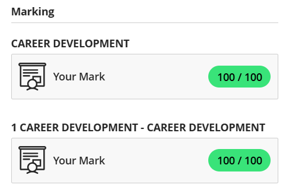
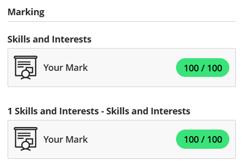
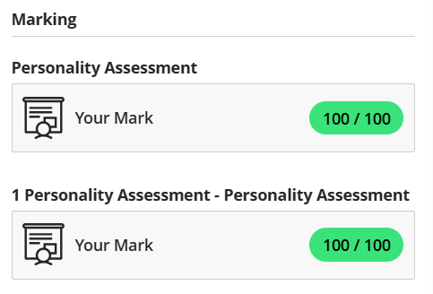
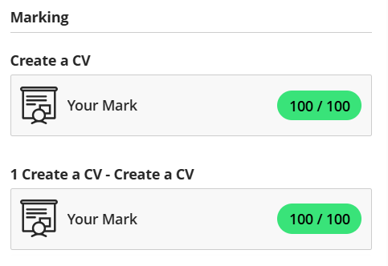
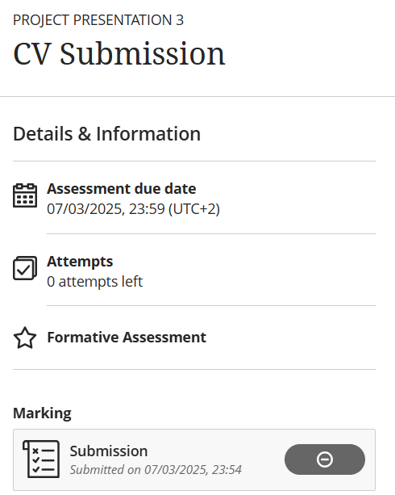

# My-Digital-Portfolio
👋 Welcome to my Digital Portfolio!
I am Adaeze Princess Ugbobuaku, a third-year ICT student specializing in Application Development at CPUT. This portfolio highlights my journey through career planning, skill development, and self-reflection using the STAR Method (Situation, Task, Action, Result). This is a glimpse into my growth, passions, and future in tech.

## Career Counselling

### Evidence

### Reflection:

- **S:** Although I had a general idea of the career I wanted to pursue, within the IT field, I was unsure of the exact steps needed to achieve it such as what actions to take, what qualifications were needed or how to move forward in that career path.  

- **T:** I needed to gain clarity on how to set meaningful career goals and understand the steps I should be taking to move forward with purpose. This involved researching various IT career paths, identifying the necessary qualifications and skills, and outlining practical actions to help guide my progress.  

- **A:** To address this, I decided to go through the Career Counselling module. While reading, I reflected on several key areas that helped me align with the right direction. These included:
  - Clearly defining my career goal
  - Thinking about where I want to be in the next 3 - 5 years
  - Listing the skills I want to develop along the way
  - Researching various IT career paths
  
- **R:** By completing these exercises, I gained clarity and direction. I now have a stronger understanding of my career path and feel more confident in the small, actionable steps I need to take to achieve my long-term goals.

## Skills & Interests

### Evidence

### Reflection

- **S:** I was uncertain about whether my technical and soft skills were at the level needed to succeed in the IT field. When I began applying for jobs, I noticed that many of the roles required skills I was either unfamiliar with or not confident in. This left me feeling underprepared and unsure about where my strengths truly lay.

- **T:** I needed to identify the in-demand technical skills in the job market and take action to improve in the areas most relevant to my goals. I also wanted to determine whether my interests and values aligned with my potential career path.

- **A:** I started by browsing job listings to identify common skills required across roles I could realistically apply for. From there, I began a few Udemy courses to build my technical capabilities. I also completed a few LinkedIn Learning courses to develop my soft skills such as leadership and time management.  

  - #### Technical skills  
  
    - 📄 View My [Udemy Courses Progress](./udemy_course_progress.png).
    - 📁 Check out my [Hangman project](./Hangman.java)! I developed it using Java.
    - 📁 View my [profile card](https://github.com/PrincessUgbobuaku/My-Profile-Page) mobile application using React Native. I plan on expanding it into a fully functional, interactive user profile system with features like editing personal details, uploading profile pictures, and integrating backend data for real-time updates.

  - #### Soft skills  

    - View my certificates of completion for [Project Leadership](./project_leadership_linkedin_learning.png) and [Time Management](./time_management_linkedin_learning.png).

    The career development module also encouraged us to reflect on our values, mine being:  
    
    - **Discipline:** I do take my work very seriously and always stick to my already planned goals.
    - **Respect:** I will always treat others fairly and appreciate diverse opinions in the workplace.
    - **Teamwork:** I value working with other talented individuals and contributing to a common goal.
    - **Trust:** I value honesty above all and being reliable.

- **R:** This process gave me a much clearer sense of direction and confidence. Along the way, I discovered a real passion for web development and React Native, particularly for creating cross-platform mobile apps. I now have a structured learning plan tailored to both my interests and the needs of the job market. I've also grown more aware of my strengths, values, and the soft skills I bring to the table.

## Personality Assessment

### Evidence

### Reflection

- **S:** As part of my career development journey, I had to complete a personality assessment module. At the time, I was still trying to figure out how my personality traits could impact my career choices, work style, and communication with others in team environments.

- **T:** The goal was to understand myself better through a personality test and reflect on how my traits align with potential roles and responsibilities in the workplace. I needed to evaluate what environments would bring out the best in me and how I could use my personality strengths in my career.

- **A:** I took a personality test, which identified me as an ISTP (Virtuoso). This profile described me as an independent, practical problem-solver who thrives on exploring how things work. I connected deeply with this, especially the parts about hands-on learning, curiosity, and being adaptable in unpredictable situations. As I reflected, I could see how this aligned with my passion for software development, where logical thinking and creativity are often needed on the spot. I also appreciated the reminder that while I enjoy working independently, I need to be mindful of collaboration in team projects which is a key soft skill.

- **R:** Through this assessment, I gained valuable insight into how I approach challenges and work environments. It helped me understand how my personality naturally aligns with my chosen career path. I now have more confidence in choosing roles that fit me.

## Create a CV

### Evidence

### Reflection

- **S:** Although I already had a CV, I quickly realized it was outdated and no longer aligned with the career path I was working towards. It mostly included skills and experience from the restaurant and admin jobs that I worked at, which no longer reflected my current goals in the IT field.

- **T:** I needed to create a new, professional CV that accurately represented my current technical and soft skills, education, and aspirations.

- **A:** After reading the "Create a CV" module and doing additional research, I learned the importance of tailoring my CV to each job I apply for. I updated the format of my original CV to give it a clean, modern look, removed irrelevant experience, and added new sections highlighting my technical skills and soft skills. I also added projects and aligned my CV with roles in application development.

- **R:** I now have a CV that reflects where I am in my career and where I want to go. I’ve learned that CVs aren’t static and should evolve as my skills and experiences do. I feel much more confident applying for roles with a document that truly represents me.

## CV Submission

### Evidence

- 📄 [View My CV](./adaeze_princess_ugbobuaku_CV.pdf)  
- ✍️ CV Review: https://github.com/wil-it2025/cv-tutorial-PrincessUgbobuaku.git 

### Reflection

- **S:** After updating and finalizing my professional CV, it was time to submit it for review and job applications.

- **T:** I needed to ensure that my CV was submitted on time, in the correct format, and aligned with the requirements provided.

- **A:** I reviewed the submission instructions carefully, double-checked the content and formatting of my CV, and submitted it before the deadline through Blackboard.

- **R:** I successfully submitted a CV I was confident in, meeting all the submission criteria and showcasing my updated skills and experience

