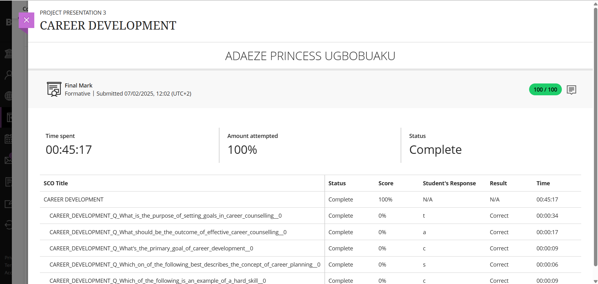
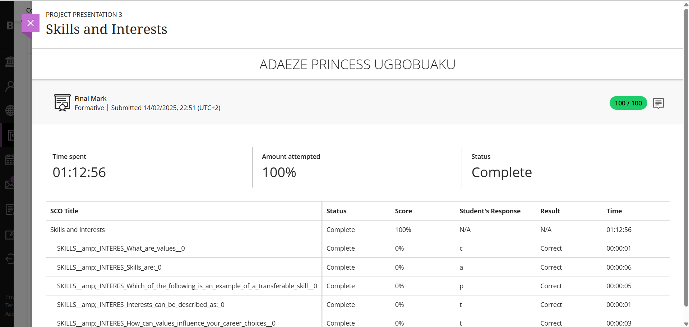
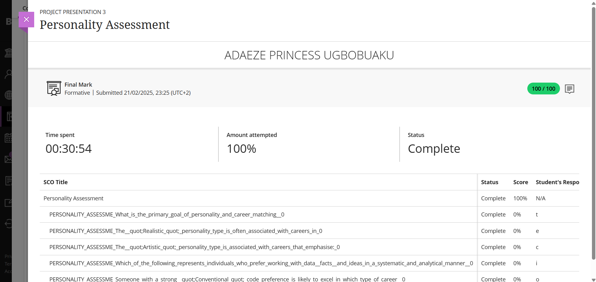
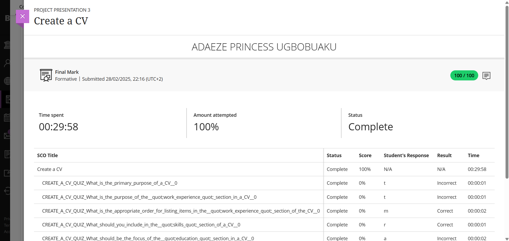
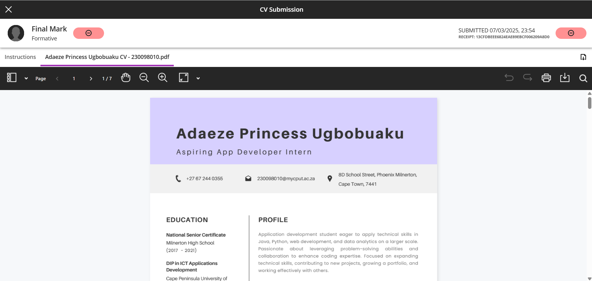
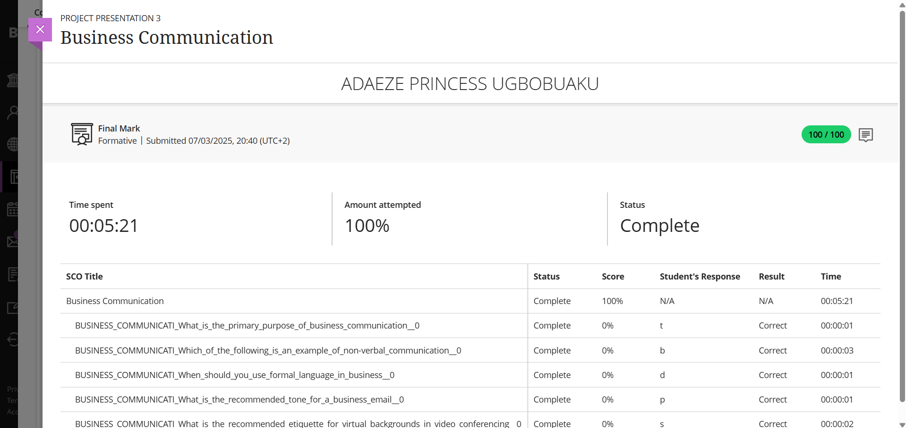
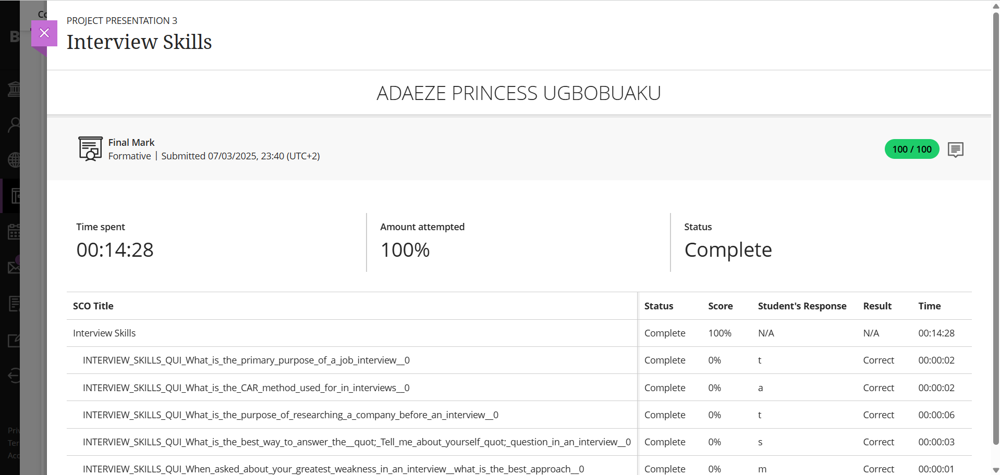
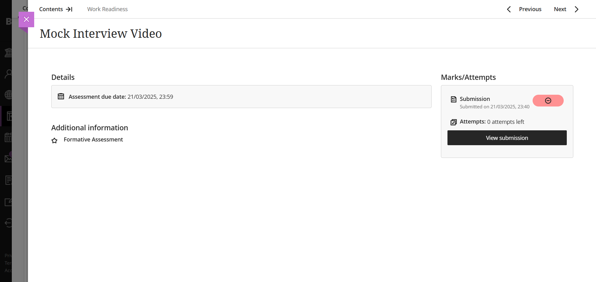
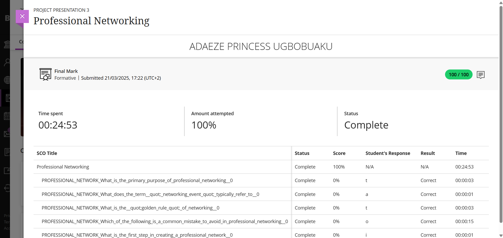

# My-Digital-Portfolio
👋 Welcome to my Digital Portfolio!
I am Adaeze Princess Ugbobuaku, a third-year ICT student specializing in Application Development at CPUT. This portfolio highlights my journey through career planning, skill development, and self-reflection using the STAR Method (Situation, Task, Action, Result). This is a glimpse into my growth, passions, and future in tech.

## Career Counselling

### Evidence

### Reflection:

- **S:** Although I had a general idea of the career I wanted to pursue, within the IT field, I was unsure of the exact steps needed to achieve it such as what actions to take, what qualifications were needed or how to move forward in that career path.  

- **T:** I needed to gain clarity on how to set meaningful career goals and understand the steps I should be taking to move forward with purpose. This involved researching various IT career paths, identifying the necessary qualifications and skills, and outlining practical actions to help guide my progress.  

- **A:** To address this, I decided to go through the Career Counselling module. While reading, I reflected on several key areas that helped me align with the right direction. These included:
  - Clearly defining my career goal
  - Thinking about where I want to be in the next 3 - 5 years
  - Listing the skills I want to develop along the way
  - Researching various IT career paths
  
- **R:** By completing these exercises, I gained clarity and direction. I now have a stronger understanding of my career path and feel more confident in the small, actionable steps I need to take to achieve my long-term goals.

## Skills & Interests

### Evidence

### Reflection

- **S:** I was uncertain about whether my technical and soft skills were at the level needed to succeed in the IT field. When I began applying for jobs, I noticed that many of the roles required skills I was either unfamiliar with or not confident in. This left me feeling underprepared and unsure about where my strengths truly lay.

- **T:** I needed to identify the in-demand technical skills in the job market and take action to improve in the areas most relevant to my goals. I also wanted to determine whether my interests and values aligned with my potential career path.

- **A:** I started by browsing job listings to identify common skills required across roles I could realistically apply for. From there, I began a few Udemy courses to build my technical capabilities. I also completed a few LinkedIn Learning courses to develop my soft skills such as leadership and time management.  

  - #### Technical skills  
  
    - 📄 View My [Udemy Courses Progress](./udemy_course_progress.png).
    - 📁 Check out my [Hangman project](./Hangman.java)! I developed it using Java.
    - 📁 View my [profile card](https://github.com/PrincessUgbobuaku/My-Profile-Page) mobile application using React Native. I plan on expanding it into a fully functional, interactive user profile system with features like editing personal details, uploading profile pictures, and integrating backend data for real-time updates.

  - #### Soft skills  

    - View my certificates of completion for [Project Leadership](./project_leadership_linkedin_learning.png) and [Time Management](./time_management_linkedin_learning.png).

    The career development module also encouraged us to reflect on our values, mine being:  
    
    - **Discipline:** I do take my work very seriously and always stick to my already planned goals.
    - **Respect:** I will always treat others fairly and appreciate diverse opinions in the workplace.
    - **Teamwork:** I value working with other talented individuals and contributing to a common goal.
    - **Trust:** I value honesty above all and being reliable.

- **R:** This process gave me a much clearer sense of direction and confidence. Along the way, I discovered a real passion for web development and React Native, particularly for creating cross-platform mobile apps. I now have a structured learning plan tailored to both my interests and the needs of the job market. I've also grown more aware of my strengths, values, and the soft skills I bring to the table.

## Personality Assessment

### Evidence

### Reflection

- **S:** As part of my career development journey, I had to complete a personality assessment module. At the time, I was still trying to figure out how my personality traits could impact my career choices, work style, and communication with others in team environments.

- **T:** The goal was to understand myself better through a personality test and reflect on how my traits align with potential roles and responsibilities in the workplace. I needed to evaluate what environments would bring out the best in me and how I could use my personality strengths in my career.

- **A:** I took a personality test, which identified me as an ISTP (Virtuoso). This profile described me as an independent, practical problem-solver who thrives on exploring how things work. I connected deeply with this, especially the parts about hands-on learning, curiosity, and being adaptable in unpredictable situations. As I reflected, I could see how this aligned with my passion for software development, where logical thinking and creativity are often needed on the spot. I also appreciated the reminder that while I enjoy working independently, I need to be mindful of collaboration in team projects which is a key soft skill.

- **R:** Through this assessment, I gained valuable insight into how I approach challenges and work environments. It helped me understand how my personality naturally aligns with my chosen career path. I now have more confidence in choosing roles that fit me.

## Create a CV

### Evidence

### Reflection

- **S:** Although I already had a CV, I quickly realized it was outdated and no longer aligned with the career path I was working towards. It mostly included skills and experience from the restaurant and admin jobs that I worked at, which no longer reflected my current goals in the IT field.

- **T:** I needed to create a new, professional CV that accurately represented my current technical and soft skills, education, and aspirations.

- **A:** After reading the "Create a CV" module and doing additional research, I learned the importance of tailoring my CV to each job I apply for. I updated the format of my original CV to give it a clean, modern look, removed irrelevant experience, and added new sections highlighting my technical skills and soft skills. I also added projects and aligned my CV with roles in application development.

- **R:** I now have a CV that reflects where I am in my career and where I want to go. I’ve learned that CVs aren’t static and should evolve as my skills and experiences do. I feel much more confident applying for roles with a document that truly represents me.

## CV Submission

### Evidence

- 📄 [View My CV](./adaeze_princess_ugbobuaku_CV.pdf)  
- ✍️ CV Review: https://github.com/wil-it2025/cv-tutorial-PrincessUgbobuaku.git 

### Reflection

- **S:** After updating and finalizing my professional CV, it was time to submit it for review and job applications.

- **T:** I needed to ensure that my CV was submitted on time, in the correct format, and aligned with the requirements provided.

- **A:** I reviewed the submission instructions carefully, double-checked the content and formatting of my CV, and submitted it before the deadline through Blackboard.

- **R:** I successfully submitted a CV I was confident in, meeting all the submission criteria and showcasing my updated skills and experience
  

## Business Communication

### Evidence

### Reflection

- **S:** When I first started my internship, I found it difficult to adapt to the professional communication style expected in the workplace. I was used to casual messages in class groups or student projects, but here I had to interact with supervisors, clients, and developers using clear, respectful, and concise language.

- **T:** My goal was to improve my business communication skills — specifically in how I write professional emails, speak during stand-up meetings, and ask or respond to questions in team discussions. I also wanted to gain confidence in using the correct tone and terminology.

- **A:** I completed the Business Communication module to learn the principles of workplace communication. I also paid close attention during meetings and email exchanges, observing the specific terminology and professional tone my colleagues used. I made a conscious effort to incorporate these terms into my daily stand-up updates and team interactions. I also practiced structuring my emails more clearly, using appropriate subject lines and greetings.

- **R:** Over time, I became more confident in my communication. My messages were clearer, and I was able to express myself more professionally during meetings. I received positive feedback from my mentor and peers, and I now feel more prepared for any communication situation in a professional environment.

## Interview Skills

### Evidence

### Reflection

- **S:** Before starting my internship, I lacked confidence in interviews. I often struggled to express myself clearly or highlight my strengths effectively. I realized that even though I had the skills, I wasn’t communicating them well during interviews.

- **T:** I needed to develop my interview skills, particularly in how I present myself, respond to questions professionally, and showcase my strengths using real examples. My goal was to become more comfortable and articulate during both mock and real interviews.

- **A:** I completed the Interview Skills module, which covered important techniques like using the STAR method to answer questions, maintaining good posture, speaking clearly, and dressing appropriately for an interview. I practiced answering common interview questions and reflected on my past experiences to prepare meaningful responses. I also worked on improving my body language and eye contact, and rehearsed speaking in a calm and confident tone.

- **R:** These efforts helped me feel more prepared and composed in interviews. I now approach interviews with confidence and structure my answers clearly using the STAR method. I believe these skills played a big role in helping me secure my current internship, and I continue to build on them as I grow professionally and prepare for future opportunities.

## Mock Interview

### Evidence
For my mock interview, I applied several important skills that I had learned from the Interview Skills module, including:

- Dressing smartly and professionally
- Speaking clearly and articulating my thoughts
- Structuring answers using the STAR method
- Maintaining confident body language and eye contact
- Actively listening and responding thoughtfully to each question
- Staying calm and focused under pressure

This mock interview was not just a simulation — it helped me practice in a realistic setting and gave me the confidence I needed.

🔗 Watch my mock interview here:
[📥 Download my mock interview video (raw)](https://raw.githubusercontent.com/PrincessUgbobuaku/My-Digital-Portfolio/main/Mock%20Interview%20-%20230098010%20-%20Compressed.mp4)

### Reflection

- **S:** As part of our internship preparation, we were tasked with completing a mock interview. This was meant to simulate a real-world interview scenario where we would apply the communication and presentation skills we had developed.

- **T:** My goal was to approach the mock interview as professionally as possible — as if it were a real job opportunity. I wanted to show confidence, clearly articulate my experiences, and apply the interview strategies I had learned.

- **A:** I prepared by revising key questions and practicing my answers using the STAR method. I chose professional attire for the video, created a quiet and presentable environment, and ensured I had a plain, clear background that was free of distractions. I also recorded the interview using clear audio and good lighting. During the interview, I paid close attention to my tone, avoided filler words, and stayed focused on answering the questions thoroughly and with structure.

- **R:** The mock interview was a valuable experience. It helped me identify areas to work on — such as slowing down when I speak and elaborating on technical experience — but overall, I was able to communicate confidently and clearly. I believe doing this mock interview was an important step that directly contributed to how well I performed during the real interview that led to me getting my internship.

## Professional Networking

### Evidence

####LinkedIn Profile

[insert below]

####Indeed Profile

[insert below]

### Reflection

- **S:** As I was entering the professional world through my internship, I realized I had very few connections in the tech industry. I knew that building a professional network was important for finding job opportunities, learning from others, and growing in my career, but I didn’t know how or where to begin.

- **T:** My task was to build and strengthen my professional network, both online and in person. This involved creating profiles on networking platforms like LinkedIn and Indeed, connecting with others in my field, and engaging with the tech community in meaningful ways.

- **A:** I started by updating and polishing my LinkedIn profile, adding a professional photo, listing my skills, and describing my education and internship experience. I connected with lecturers, peers, and other developers I met through the internship. I followed industry pages and engaged with posts that aligned with my interests in web and mobile development.

I also created a profile on Indeed, where I explored job opportunities, followed companies I was interested in, and began applying for internships that matched my skills. I made sure to tailor my CV and cover letter for each application, and used both platforms to keep up with trends in the job market.

In addition to online networking, I took the initiative to introduce myself to colleagues during my internship, ask questions about their career paths, and build relationships with people already working in the industry.

- **R:** As a result, I grew my LinkedIn network significantly and started receiving messages from recruiters and fellow developers. Using Indeed, I was able to apply for several opportunities and gain more confidence in navigating the job market. Most importantly, I began forming professional connections that I believe will benefit me long-term. This experience showed me that networking is not just about looking for jobs — it's about learning, growing, and supporting others in the industry.

